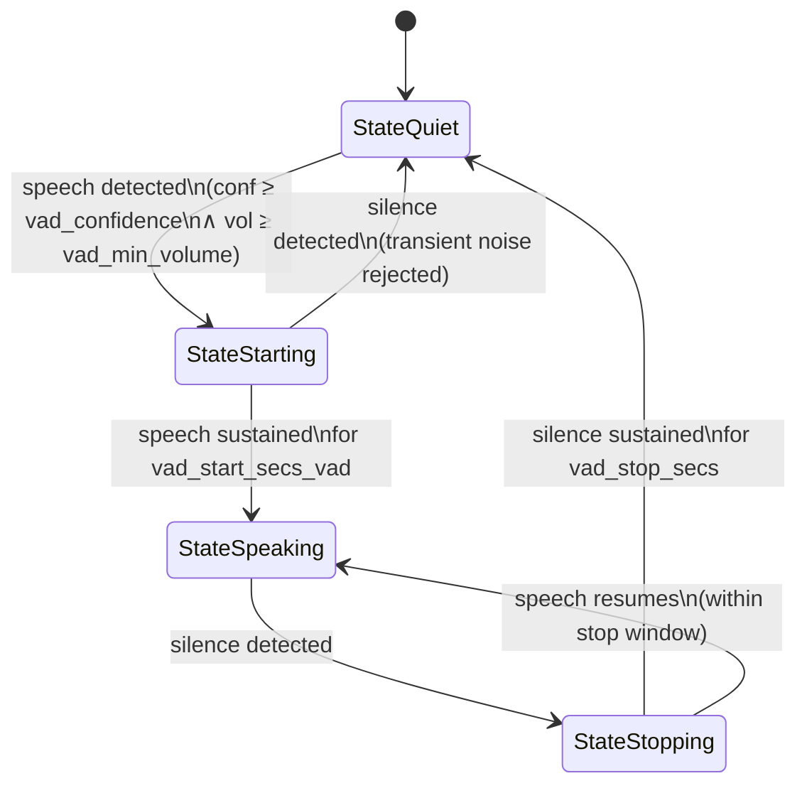

Voxray processes audio as a stream of typed frames moving through a pipeline. Every stage in that pipeline operates on a defined sample rate and encoding. Understanding the format standards, codec conversion utilities, and VAD state machine makes it straightforward to integrate new providers, tune detection sensitivity, and reason about latency.

---

## Audio Format Standards

All internal audio in Voxray uses **PCM 16-bit little-endian mono**. Providers that deliver other encodings (G.711 telephony, Opus/WebRTC) are converted at the transport boundary before frames enter the pipeline.

| Pipeline Stage | Sample Rate | Format |
|----------------|-------------|--------|
| STT input (`AudioRawFrame`) | 16,000 Hz | PCM 16-bit LE mono |
| TTS output (`TTSAudioRawFrame`) | 24,000 Hz | PCM 16-bit LE mono |
| WebRTC inbound (raw RTP) | 48,000 Hz | Opus (decoded to PCM at boundary) |
| WebRTC outbound (raw RTP) | 48,000 Hz | PCM → Opus at boundary |
| Telephony inbound | 8,000 Hz | G.711 μ-law (decoded at boundary) |
| Telephony outbound | 8,000 Hz | G.711 μ-law (encoded at boundary) |

The two canonical constants used throughout the codebase:

```go
const DefaultInSampleRate  = 16000  // STT input rate
const DefaultOutSampleRate = 24000  // TTS output rate
```

<Note>
Always resample to `DefaultInSampleRate` (16 kHz) before pushing audio into the pipeline. Always resample from `DefaultOutSampleRate` (24 kHz) when encoding for outbound WebRTC or telephony. Mismatched rates produce audio that plays at the wrong speed and causes STT errors.
</Note>

---

## G.711 Codecs

G.711 is the standard codec for telephony (PSTN). Voxray includes two implementations for both the A-law and μ-law variants.

### μ-law (PCMU, G.711)

μ-law is used by Twilio, Telnyx, Plivo, and Exotel. It delivers 8-bit samples at 8 kHz that are logarithmically compressed for telephone-grade dynamic range.

```go
// Encode 16-bit PCM sample to μ-law
encoded := audio.EncodeULaw(sample int16) byte

// Decode μ-law byte to 16-bit PCM sample
decoded := audio.DecodeULaw(b byte) int16
```

Source: `pkg/audio/ulaw.go`

### A-law (PCMA, G.711)

A-law is the European equivalent of μ-law, used by some SIP/VoIP providers.

```go
// Encode 16-bit PCM sample to A-law
encoded := audio.EncodeALaw(sample int16) byte

// Decode A-law byte to 16-bit PCM sample
decoded := audio.DecodeALaw(b byte) int16
```

Source: `pkg/audio/alaw.go`

Both codecs operate sample-by-sample. The telephony adapter loops over each inbound byte, decodes it to a 16-bit PCM sample, collects samples into a buffer, and then resamples 8 kHz → 16 kHz before handing the `AudioRawFrame` to the pipeline. The reverse happens on output.

---

## Resampling

`pkg/audio/resample.go` provides linear interpolation resampling for 16-bit mono PCM. It is fast, allocation-efficient, and correct for the moderate ratio conversions used by Voxray (2:1, 3:1, 6:1).

### Function Signature

```go
// Resample16Mono converts 16-bit mono PCM from inRate to outRate using linear interpolation.
// in and out can be the same slice if inRate == outRate (no-op path).
// out must have capacity: len(out) >= len(in) * outRate / inRate (rounded up).
// Returns the (re)populated out slice.
func Resample16Mono(in []byte, inRate, outRate int, out []byte) []byte
```

A convenience wrapper that handles allocation:

```go
func Resample16MonoAlloc(in []byte, inRate, outRate int) []byte
```

### Key Conversion Paths

| Conversion | Ratio | Where used |
|------------|-------|------------|
| 48,000 → 16,000 Hz | 3:1 downsample | WebRTC inbound (after Opus decode) |
| 24,000 → 48,000 Hz | 2:1 upsample | WebRTC outbound (before Opus encode) |
| 8,000 → 16,000 Hz | 2:1 upsample | Telephony inbound (after G.711 decode) |
| 24,000 → 8,000 Hz | 3:1 downsample | Telephony outbound (before G.711 encode) |

### How Linear Interpolation Works

For each output sample index `i`, the resampler maps it back to a floating-point position in the input:

```text
pos  = i × (inRate / outRate)
idx  = floor(pos)
frac = pos - idx
sample = in[idx] × (1 - frac) + in[idx+1] × frac
```

This is fast (no FFT, no filter design) and introduces minimal phase distortion at the conversion ratios Voxray uses. It is not suitable for high-quality music reproduction, but it is well-suited for voice at these sample rates.

<Tip>
Reuse the `out` slice across calls to avoid allocation in the hot path. `Resample16Mono` writes into `out[:0]` and returns the populated slice, so you can declare `var buf []byte` once and pass it on every frame.
</Tip>

---

## Voice Activity Detection (VAD)

VAD determines whether a given audio buffer contains human speech. Voxray uses VAD to gate STT calls — only segments classified as speech are transcribed, which reduces cost and latency.

### Detector Interface

```go
// Detector decides whether a given audio frame contains speech.
// Implementations assume 16-bit PCM mono by default.
type Detector interface {
    IsSpeech(f audio.Frame) (bool, error)
    SetSampleRate(sampleRate int)
}
```

`IsSpeech` returns `true` when the internal state machine is in `StateSpeaking`. `SetSampleRate` must be called with the pipeline's input rate (typically `16000`) before the first frame is processed.

### VAD State Machine

The VAD analyzer implements a four-state machine to avoid false positives from transient noise and to avoid false negatives from brief pauses within speech:



State transition logic in detail:

- **`StateQuiet → StateStarting`**: A 10 ms audio window has confidence ≥ `vad_confidence` and smoothed volume ≥ `vad_min_volume`.
- **`StateStarting → StateSpeaking`**: Speech conditions have held continuously for `vad_start_secs_vad` seconds. Short noises (coughs, clicks) that don't sustain are rejected here.
- **`StateStarting → StateQuiet`**: A single silent window while in `StateStarting` resets back to quiet — the noise was transient.
- **`StateSpeaking → StateStopping`**: A 10 ms window is silent.
- **`StateStopping → StateQuiet`**: Silence has held for `vad_stop_secs` seconds.
- **`StateStopping → StateSpeaking`**: Speech is detected again before the stop timer expires — the user is still talking.

The analyzer processes audio in **10 ms windows** (160 samples at 16 kHz). Each window computes RMS energy, normalizes to a confidence score in `[0, 1]`, applies exponential smoothing to the volume track, and advances the state machine.

### VAD Configuration

| Config Key | Description | Default | Recommended Range |
|------------|-------------|---------|-------------------|
| `vad_type` | Algorithm: `"energy"` or `"silero"` | `"energy"` | — |
| `vad_confidence` | Minimum voice confidence score `[0..1]` | `0.7` | `0.5` – `0.85` |
| `vad_start_secs_vad` | Duration of sustained speech to enter `StateSpeaking` | `0.2` | `0.1` – `0.4` |
| `vad_stop_secs` | Duration of sustained silence to exit `StateSpeaking` | `0.2` | `0.1` – `0.5` |
| `vad_min_volume` | Minimum exponentially-smoothed RMS volume `[0..1]` | `0.2` | `0.05` – `0.4` |
| `vad_threshold` | Raw RMS energy threshold for energy-based VAD | `0.02` | `0.01` – `0.05` |
| `vad_batch_size` | Audio batch size fed to VAD per call (samples); `0` = no batching | `0` | `0`, `160`, `320` |

Example configuration for a quiet office environment:

```json
{
  "vad_type": "energy",
  "vad_confidence": 0.65,
  "vad_start_secs_vad": 0.15,
  "vad_stop_secs": 0.25,
  "vad_min_volume": 0.15,
  "vad_threshold": 0.015
}
```

### Energy-Based VAD

The default backend (`vad_type: "energy"`) computes RMS energy over each 10 ms window and normalizes it against `vad_threshold` to produce a confidence score:

```go
// voiceConfidence returns an energy-based confidence in [0, 1].
// conf = clamp(rms / threshold, 0, 1)
```

This is very fast (no model inference, no CGO) and works well in environments with consistent background noise levels. It is sensitive to `vad_threshold` — if too low, ambient noise triggers speech; if too high, quiet speech is missed.

### Silero VAD

`vad_type: "silero"` uses the [Silero VAD](https://github.com/snakers4/silero-vad) neural network model. It produces more accurate confidence scores than energy-based detection, particularly for:

- Soft-spoken users
- Environments with variable background noise
- Non-English speech patterns

<Warning>
Silero VAD requires CGO and the ONNX Runtime or a compatible Go binding to be present at build time. Set `CGO_ENABLED=1` and include the required shared libraries in your Docker image. Without CGO, only `vad_type: "energy"` is available.
</Warning>

---

## Turn Detection

Turn detection determines when the user has **finished speaking** and the pipeline should trigger STT and the LLM response. It operates above VAD — VAD detects per-frame speech/silence, while turn detection tracks the overall conversational turn.

### Silence-Based Turn Detection (default)

```json
{"turn_detection": "silence"}
```

This is the default and recommended mode. After VAD transitions from `StateSpeaking` to `StateQuiet` and the silence persists for `turn_stop_secs`, the pipeline emits an end-of-turn signal, sends the buffered audio to STT, and starts the LLM response.

### Disabled Turn Detection

```json
{"turn_detection": "none"}
```

Disables automatic turn detection entirely. The pipeline will not emit end-of-turn signals. Use this when an external system (e.g., a client-side push-to-talk button) controls turn boundaries by sending explicit `EndFrame` signals over the transport.

### Turn Detection Configuration

| Config Key | Description | Default |
|------------|-------------|---------|
| `turn_stop_secs` | Seconds of silence after speech ends before treating it as end-of-turn | `3.0` |
| `turn_pre_speech_ms` | Milliseconds of audio buffered before VAD detects speech, prepended to the turn | `500` |
| `turn_max_duration_secs` | Maximum duration of a single user turn; forces end-of-turn even if the user keeps talking | `8.0` |
| `turn_async` | Run end-of-turn analysis asynchronously (non-blocking) | `false` |
| `user_turn_stop_timeout_secs` | Seconds to wait for the user to begin speaking before timing out | varies |
| `user_idle_timeout_secs` | Seconds after the bot finishes speaking that the user hasn't responded before a `UserIdleFrame` is emitted | varies |

### turn_pre_speech_ms

When VAD detects the start of speech, the pipeline needs a small buffer of audio that arrived *just before* the detection threshold was crossed — otherwise the first syllable of the user's utterance is clipped. `turn_pre_speech_ms` controls how much pre-speech audio is prepended to the turn buffer.

```json
{"turn_pre_speech_ms": 500}
```

500 ms is a safe default. Reduce it to 200–300 ms if memory or latency is critical. Increasing it beyond 800 ms rarely improves STT accuracy.

### UserIdleFrame

When the bot finishes its response and the user has not begun speaking within `user_idle_timeout_secs`, the pipeline emits a **`UserIdleFrame`**. Your pipeline handler can react to this frame by:

- Prompting the user (sending a TTS message like "Are you still there?")
- Ending the session gracefully
- Incrementing an idle counter and escalating after multiple idle events

```json
{"user_idle_timeout_secs": 15}
```

<Tip>
Combine `user_idle_timeout_secs` with `user_turn_stop_timeout_secs` for complete coverage: `user_turn_stop_timeout_secs` handles the case where the user never starts speaking, and `user_idle_timeout_secs` handles the case where they go silent mid-conversation after the bot responds.
</Tip>

### Turn Detection Tuning Guide

| Scenario | Recommendation |
|----------|---------------|
| Call center (noisy background) | Increase `vad_threshold` to `0.03`; increase `turn_stop_secs` to `4.0` to tolerate hold music and background noise |
| Fast-paced conversation (low latency) | Decrease `turn_stop_secs` to `1.5`–`2.0`; decrease `vad_stop_secs` to `0.15` |
| Non-native speakers (longer pauses) | Increase `turn_stop_secs` to `4.0`–`5.0`; increase `vad_start_secs_vad` to `0.3` |
| Push-to-talk UI | Set `turn_detection: "none"`; send `EndFrame` from client on button release |
| Long-form dictation | Increase `turn_max_duration_secs` to `60.0` or more; set `turn_stop_secs` to `2.0` |
