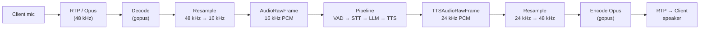
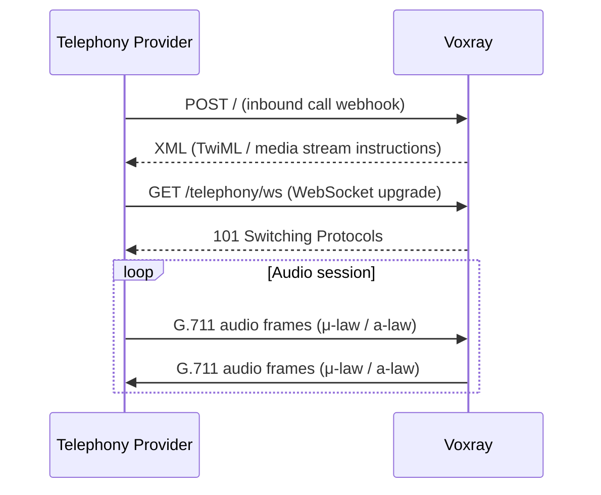

Every pipeline session in Voxray starts with a **Transport**: the boundary between a network connection and the frame-processing pipeline. Transports receive raw data from clients, deserialize it into typed `frames.Frame` values, and send serialized frames back. Each connection gets exactly one transport and one goroutine-isolated session.

## The Transport Interface

All transports implement the same four-method interface defined in `pkg/transport/transport.go`:

```go
// Transport provides frame input and output for a pipeline (e.g. WebSocket client).
type Transport interface {
    Input()  <-chan frames.Frame
    Output() chan<- frames.Frame
    Start(ctx context.Context) error
    Close() error
}
```

| Method | Direction | Description |
|--------|-----------|-------------|
| `Input()` | Client → Pipeline | Receive-only channel; yields deserialized frames arriving from the client. Closed when the transport shuts down. |
| `Output()` | Pipeline → Client | Send-only channel; frames written here are serialized and sent to the client. Do not send after `Close`. |
| `Start(ctx)` | — | Launches internal goroutines (read loop, write loop). Honors context cancellation for graceful shutdown. |
| `Close()` | — | Tears down the connection and closes both channels. Idempotent; safe to call from any goroutine. |

<Note>
One transport = one session. When a connection drops or `Close` is called, both the `Input` and `Output` channels are closed, signaling the pipeline to terminate. There is no reconnect logic at the transport level — reconnection must be handled by the client.
</Note>

---

## WebSocket Transport

### ConnTransport

`ConnTransport` in `pkg/transport/websocket/websocket.go` is the primary transport for browser and mobile clients. It wraps a single `*websocket.Conn` (gorilla/websocket) and enforces strict concurrency discipline: a single `readLoop` goroutine owns all reads, and a single `writeLoop` goroutine owns all writes. No other code touches the connection.

```go
type ConnTransport struct {
    conn       *websocket.Conn
    serializer serialize.Serializer
    inCh       chan frames.Frame   // readLoop → pipeline
    outCh      chan frames.Frame   // pipeline → writeLoop
    closed     chan struct{}
    once       sync.Once
    // write coalescing
    writeCoalesceMs        int
    writeCoalesceMaxFrames int
    // activity tracking
    lastActivity atomic.Int64
    // optional max-duration enforcement
    maxDurationAfterFirstAudio time.Duration
    onMaxDurationTimeout       func()
}
```

On `Start(ctx)`, two goroutines are launched:

- **`readLoop`** — calls `conn.ReadMessage()` in a tight loop, deserializes each message via the configured `Serializer`, and pushes the resulting `Frame` onto `inCh`. On any read error, the loop returns and triggers `Close()`.
- **`writeLoop`** — reads frames from `outCh`, serializes them, and writes to the WebSocket. Supports optional write coalescing (see below). On any write error, the loop returns and triggers `Close()`.

A third goroutine watches `ctx.Done()` so that context cancellation propagates to `Close()`, and another optional goroutine monitors inactivity via `LastActivity()`.

The maximum read message size is fixed at **1 MiB** (`DefaultReadLimit`) to prevent memory exhaustion from oversized client frames.

### Wire Formats

The serializer is selected per-connection based on the upgrade request. Pass query parameters when opening the WebSocket to choose the format.

<Tabs>
  <Tab title="JSON (default)">
    The default format requires no query parameter. All messages are WebSocket text frames carrying a JSON envelope:

    ```json
    {"type": "audio_raw", "data": {"audio": "<base64>", "sample_rate": 16000}}
    ```

    The `type` field identifies the frame kind. The `data` object carries frame-specific fields. This format is compatible with any language or SDK that can open a WebSocket and parse JSON.

    ```text
    ws://your-server/ws
    ```
  </Tab>
  <Tab title="Protobuf">
    Pass `?format=protobuf` to use binary Protobuf framing (`ProtobufSerializer` from `pkg/frames/serialize`). Messages are WebSocket binary frames. The schema mirrors the JSON field names and frame types exactly, so server-side logic is identical — only serialization changes.

    ```text
    wss://your-server/ws?format=protobuf
    ```

    Use this for lower bandwidth and parse overhead in latency-sensitive clients (native mobile, embedded).
  </Tab>
  <Tab title="RTVI">
    Pass `?rtvi=1` to enable the [Pipecat RTVI protocol](https://github.com/pipecat-ai/rtvi). RTVI is an open standard for real-time voice AI clients; it adds a handshake phase and uses RTVI-typed message envelopes.

    ```text
    wss://your-server/ws?rtvi=1
    ```

    RTVI clients (e.g. `@pipecat-ai/client-js`) use this mode. The serializer is swapped to `RTVISerializer`; the pipeline and transport internals are unchanged.
  </Tab>
</Tabs>

### Write Coalescing

In high-throughput scenarios, many small frames (e.g. audio chunks) can saturate the WebSocket write path with syscalls. Write coalescing batches consecutive frames into a single write window.

Configure it in `config.json`:

```json
{
  "ws_write_coalesce_ms": 5,
  "ws_write_coalesce_max_frames": 20
}
```

| Config Key | Description | Default |
|------------|-------------|---------|
| `ws_write_coalesce_ms` | Milliseconds to wait after the first frame before flushing the batch. `0` disables coalescing. | `0` |
| `ws_write_coalesce_max_frames` | Maximum frames per batch. Batch flushes early if this limit is hit before the timer fires. | `10` |

<Warning>
Write coalescing adds up to `ws_write_coalesce_ms` of latency per batch. For real-time voice, keep this value small (2–10 ms). Do not enable coalescing for control frames like `StartFrame` or `EndFrame` — those are already low-frequency.
</Warning>

### Session Lifecycle

```text
Client connects → HTTP upgrade → ConnTransport created → Start(ctx) →
  readLoop running | writeLoop running
       |                    |
  frames in           frames out
       |                    |
Client disconnects / ctx canceled → Close() → inCh closed, outCh closed → pipeline exits
```

One WebSocket connection equals exactly one voice session. When the connection drops for any reason (network failure, client close, server shutdown, session timeout), `Close()` is called, both channels are closed, and the pipeline goroutine exits. There is no transport-level reconnect. Clients that want to resume must open a new connection and start a new session.

The server enforces an inactivity timeout (`SessionTimeout`, default `5m`) by polling `LastActivity()` at half the timeout interval. Any successfully read or written frame resets the timer.

---

## WebRTC Transport (SmallWebRTC)

### SDP Offer / Answer

WebRTC sessions use a standard SDP offer/answer handshake before any audio flows. The client sends an HTTP POST:

```http
POST /webrtc/offer
Content-Type: application/json

{"offer": "<SDP offer string>"}
```

The server responds with:

```json
{"data": {"answer": "<SDP answer string>"}}
```

Once ICE negotiation completes, the browser or native client streams audio over RTP directly to the server.

Enable this transport in config:

```json
{"transport": "smallwebrtc"}
```

Use `"both"` to accept WebSocket and WebRTC clients simultaneously.

### Audio Flow

WebRTC delivers audio as Opus-encoded RTP packets. Voxray decodes, resamples, and re-encodes at each boundary:



<Warning>
Opus encode/decode requires CGO and the `gopus` library. If you build without CGO (`CGO_ENABLED=0`) or without gopus, WebRTC TTS audio output is unavailable. The server will still accept WebRTC connections but will not transmit audio back to the client.
</Warning>

### ICE / STUN / TURN Configuration

```json
{
  "webrtc_ice_servers": [
    {"urls": ["stun:stun.l.google.com:19302"]},
    {"urls": ["turn:your-turn-server:3478"], "username": "user", "credential": "pass"}
  ]
}
```

For non-localhost deployments, Voxray defaults to Google's public STUN server (`stun.l.google.com:19302`). STUN is sufficient for clients on open networks, but **add a TURN server for any production deployment** where clients may be behind symmetric NAT, corporate firewalls, or mobile carrier-grade NAT. Without TURN, ICE will fail for a significant fraction of real-world users.

---

## Memory Transport

The memory transport (`pkg/transport/memory`) connects two in-process pipelines directly via Go channels. It is intended exclusively for unit tests and integration tests — frames are never serialized or sent over a network.

<Warning>
Do not use the memory transport in production. It has no authentication, no session isolation, and no network boundary. Use it only in test code.
</Warning>

---

## Telephony Adapters

### How Telephony Connections Work

Telephony providers (Twilio, Telnyx, Plivo, Exotel) connect to Voxray in two phases:

1. **Webhook phase**: The provider receives an inbound call and sends `POST /` to your server. Voxray responds with XML (TwiML for Twilio, equivalent for others) instructing the provider to open a media WebSocket.
2. **Media phase**: The provider opens a WebSocket to `GET /telephony/ws` and streams audio in real time. Voxray wraps this connection in a `ConnTransport` with a provider-specific serializer.



### Supported Providers

| Provider | Config Value | Serializer | Notes |
|----------|-------------|------------|-------|
| Twilio | `runner_transport: "twilio"` | `TwilioSerializer` | μ-law (PCMU), 8 kHz |
| Telnyx | `runner_transport: "telnyx"` | `TelnyxSerializer` | μ-law (PCMU), 8 kHz |
| Plivo | `runner_transport: "plivo"` | `PlivoSerializer` | μ-law (PCMU), 8 kHz |
| Exotel | `runner_transport: "exotel"` | `ExotelSerializer` | μ-law (PCMU), 8 kHz |

### Audio Format

Telephony audio arrives as **G.711 μ-law (PCMU), 8 kHz, mono**. Voxray handles all codec conversion internally:

- **Inbound**: μ-law decode → resample 8 kHz → 16 kHz → `AudioRawFrame` (PCM 16-bit LE, 16 kHz)
- **Outbound**: `TTSAudioRawFrame` (PCM 16-bit LE, 24 kHz) → resample 24 kHz → 8 kHz → μ-law encode → telephony WebSocket

No manual codec configuration is required. Voxray selects the correct codec path based on the `runner_transport` value.

---

## Runner Session Mode (Horizontal Scaling)

Standard WebRTC requires the client to know the server address upfront. For deployments where you want to scale across multiple Voxray instances, use the **Runner session mode**:

1. Client calls `POST /start` — Voxray creates a session entry in the `SessionStore` (in-memory or Redis) and returns a `sessionId`.
2. Client sends `POST /sessions/{id}/api/offer` with the SDP offer.
3. Voxray retrieves the session, completes the WebRTC handshake, and starts the pipeline.

```http
POST /start
→ {"sessionId": "abc123"}

POST /sessions/abc123/api/offer
Content-Type: application/json
{"offer": "<sdp>"}
→ {"data": {"answer": "<sdp>"}}
```

<Tip>
Configure Redis as the session store (`session_store: "redis"`) so any Voxray instance can handle the offer, regardless of which instance processed `POST /start`. This is the recommended approach behind a load balancer.
</Tip>

---

## WebSocket Reconnection Helpers (for External Services)

When Voxray itself connects to external WebSocket APIs (e.g., streaming STT or LLM services), it uses `WebsocketServiceBase` from `pkg/transport/websocket/reconnect.go` for resilient connections with automatic reconnect and exponential backoff.

### WebSocketConnector Interface

Implement this interface in your service:

```go
type WebSocketConnector interface {
    Conn() *websocket.Conn
    SetConn(conn *websocket.Conn)
    Connect(ctx context.Context) error
    Disconnect()
    ReceiveMessages(ctx context.Context) error
}
```

### Key Methods

| Method | Description |
|--------|-------------|
| `VerifyConnection()` | Pings the current connection to confirm it is alive. |
| `TryReconnect(ctx, maxRetries, reportError)` | Reconnects with exponential backoff; calls `reportError` on each failure. |
| `SendWithRetry(ctx, messageType, data, reportError)` | Sends a message; if the send fails, reconnects and retries once. |
| `ReceiveLoop(ctx, reportError)` | Runs `ReceiveMessages` in a loop; reconnects on error when `reconnectOnError` is true. |
| `SetDisconnecting(true)` | Call before graceful shutdown to prevent spurious reconnect attempts. |

### Usage Pattern

```go
base := websocket.NewWebsocketServiceBase(myConnector, true /* reconnectOnError */)

// Send with automatic reconnect on failure
if err := base.SendWithRetry(ctx, ws.TextMessage, payload, reportErr); err != nil {
    return err
}

// Long-running receive loop with reconnect
go base.ReceiveLoop(ctx, reportErr)
```

<Info>
`WebsocketServiceBase` is used internally by services like OpenAI Realtime and Sarvam streaming. Embed or compose it in any service that holds a long-lived outbound WebSocket connection.
</Info>
