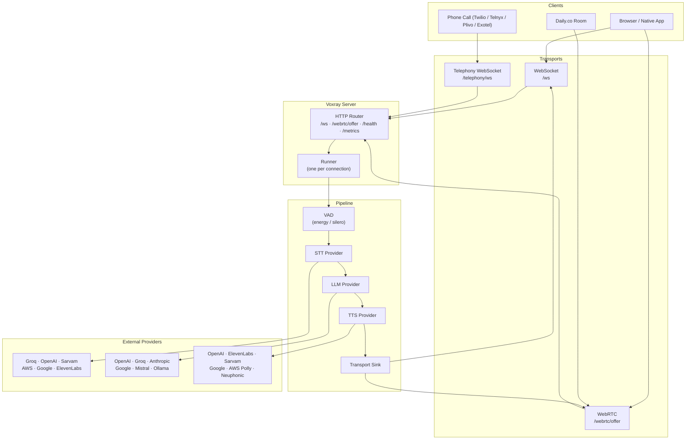

## What is Voxray?

Voxray is a **Go 1.25+ server** that turns a single JSON config file into a fully operational, real-time AI voice agent. Instead of writing audio plumbing, codec management, or provider integration code yourself, you declare your providers in `config.json` — STT, LLM, and TTS — and Voxray wires them into a low-latency streaming pipeline. Clients connect over **WebSocket** (`/ws`) or **WebRTC** (`/webrtc/offer`); telephony carriers (Twilio, Telnyx, Plivo, Exotel) and Daily.co rooms connect through the same server with a single config flag change. Every provider, model, voice, and transport setting is hot-swappable without touching application code.

## Key Capabilities

<CardGroup cols={2}>
  <Card title="40+ AI Providers" icon="microchip-ai">
    OpenAI, Anthropic, Groq, Google, AWS, ElevenLabs, Sarvam, Mistral, DeepSeek, Cerebras, Ollama, and more — across STT, LLM, and TTS stages.
  </Card>
  <Card title="WebSocket + WebRTC Transport" icon="wifi">
    Dual-transport support: JSON-over-WebSocket at `/ws` and SDP-based WebRTC at `/webrtc/offer`. Enable one or both with `"transport": "both"`.
  </Card>
  <Card title="Telephony Integration" icon="phone">
    Built-in support for Twilio, Telnyx, Plivo, Exotel, and Daily.co (rooms + optional PSTN dial-in). Swap carriers by changing `runner_transport` in config.
  </Card>
  <Card title="MCP Tool Integration" icon="wrench">
    Connect any MCP-compatible tool server so the LLM can call external APIs, databases, or custom functions mid-conversation.
  </Card>
  <Card title="Plugin System" icon="puzzle-piece">
    Extend the pipeline with built-in or custom plugins: frame filters, wake-word detection, STT mute, audio gain, interruption control, and RTVI protocol support.
  </Card>
  <Card title="S3 Conversation Recording" icon="circle-dot">
    Record full mixed audio per session and upload asynchronously to S3 in WAV format. Configurable bucket, path prefix, and worker pool.
  </Card>
  <Card title="Postgres / MySQL Transcripts" icon="database">
    Persist per-turn text transcripts (user and assistant) to a relational database with session ID, role, sequence number, and timestamp.
  </Card>
  <Card title="Prometheus Metrics" icon="chart-line">
    Production-ready observability at `/metrics` — HTTP, WebRTC, STT, LLM, and TTS metrics out of the box. Compatible with any Prometheus-compatible scraper.
  </Card>
</CardGroup>

## Why Voxray Instead of Building From Scratch?

Building a real-time voice agent pipeline without a framework means writing and maintaining:

- **Audio resampling** — converting between provider sample rates (8 kHz telephony, 16 kHz STT, 24 kHz TTS) without introducing latency or artifacts
- **Codec management** — encoding and decoding Opus for WebRTC, μ-law/a-law for telephony, PCM for STT APIs
- **Provider integration** — each STT, LLM, and TTS vendor has a different streaming API, authentication pattern, and error model
- **Turn detection and VAD** — distinguishing speech from silence, detecting when a user has finished speaking, handling barge-in
- **Concurrency and backpressure** — routing audio frames through a pipeline of goroutines without blocking or dropping frames under load

Voxray handles all of this. You supply API keys and a JSON file. You get a production pipeline.

| Without Voxray | With Voxray |
|---|---|
| Write audio resampling and codec glue | Zero audio plumbing code |
| Hard-code one STT + one LLM + one TTS | Swap any provider with a config change |
| Build your own turn detection and VAD | `"turn_detection": "silence"` with tunable thresholds |
| Instrument metrics and logging yourself | Prometheus metrics and structured JSON logs included |
| Wire WebSocket and WebRTC transports | `"transport": "both"` enables both endpoints |
| Manage telephony webhooks manually | `"runner_transport": "twilio"` handles Twilio webhook + media WebSocket |

## Architecture

Audio travels from client to provider and back through a deterministic pipeline. Each connection — WebSocket, WebRTC, or telephony — gets its own isolated runner and goroutine. The pipeline stages run in order: VAD silences background noise and detects speech segments, STT converts audio to text, LLM generates a response, TTS synthesizes audio, and the result streams back over the same transport the client connected on.

<Note>
Each connection is fully isolated — multiple concurrent clients run independent pipelines on the same server instance. There is no shared mutable state between sessions.
</Note>

## Quick Links

<CardGroup cols={2}>
  <Card title="Quickstart (WebSocket)" icon="bolt" href="/get-started/quickstart-websocket">
    Get a voice agent running over WebSocket in under 5 minutes. No CGO required.
  </Card>
  <Card title="Quickstart (WebRTC)" icon="broadcast-tower" href="/get-started/quickstart-webrtc">
    Browser-based voice agent with low-latency WebRTC transport and Opus audio.
  </Card>
  <Card title="Architecture" icon="sitemap" href="/core-concepts/architecture">
    Deep dive into the pipeline, runner, transport, and provider abstractions.
  </Card>
  <Card title="GitHub" icon="github" href="https://github.com/Voxray-AI/Voxray">
    Source code, issues, and contribution guidelines.
  </Card>
</CardGroup>
